# 200 colormaps
Cite As: Zhaoxu Liu / slandarer (2026). 200 colormaps (https://www.mathworks.com/matlabcentral/fileexchange/120088-200-colormaps), MATLAB Central File Exchange.

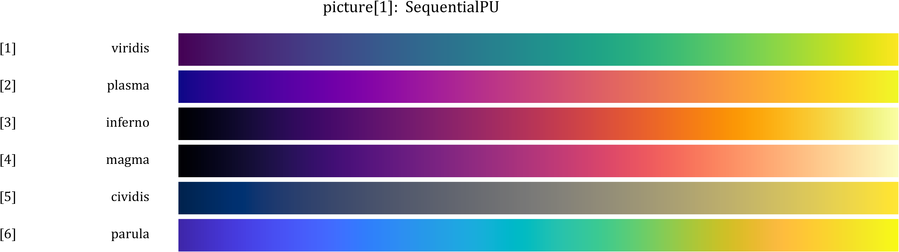
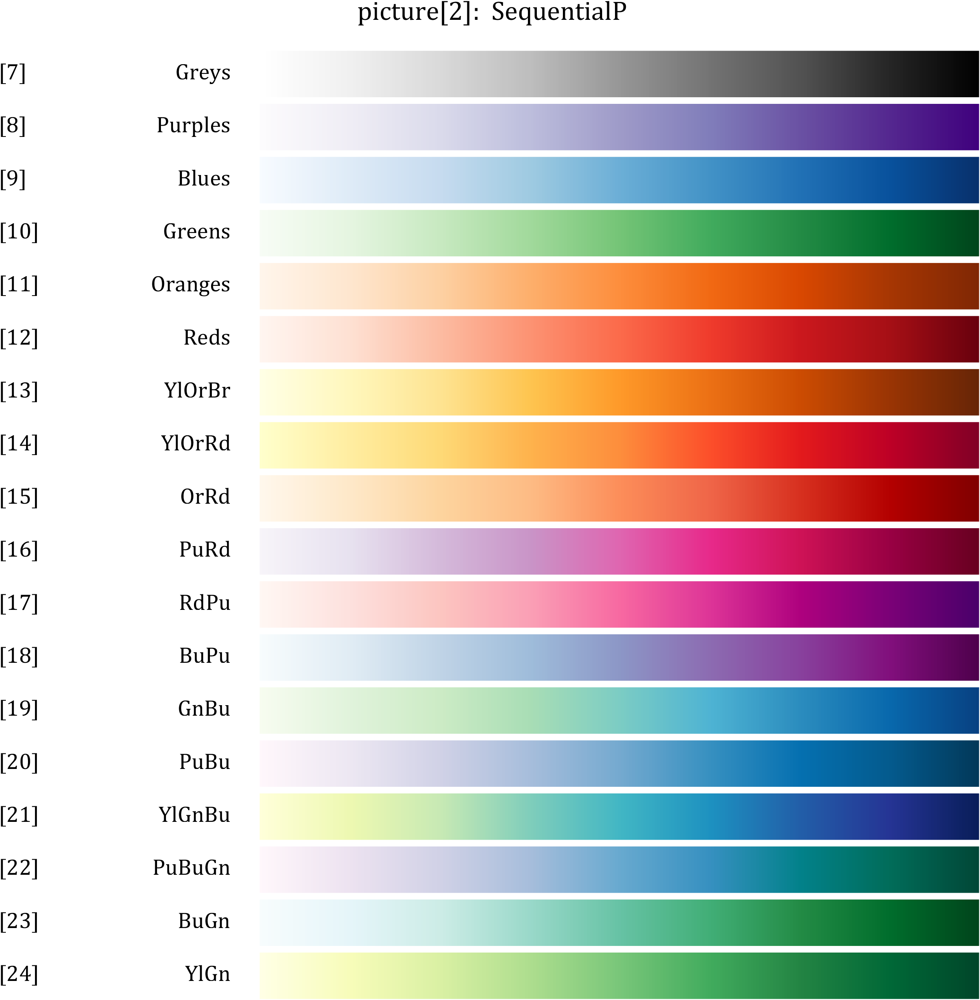
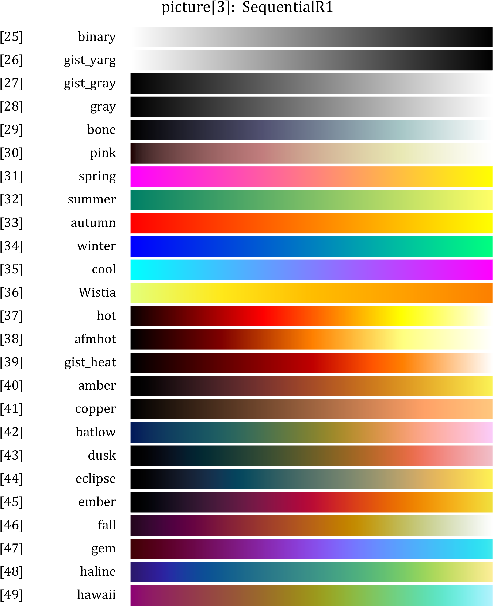
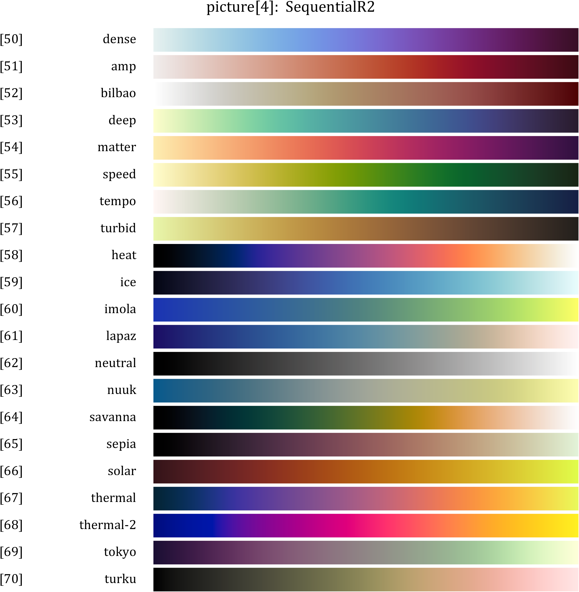
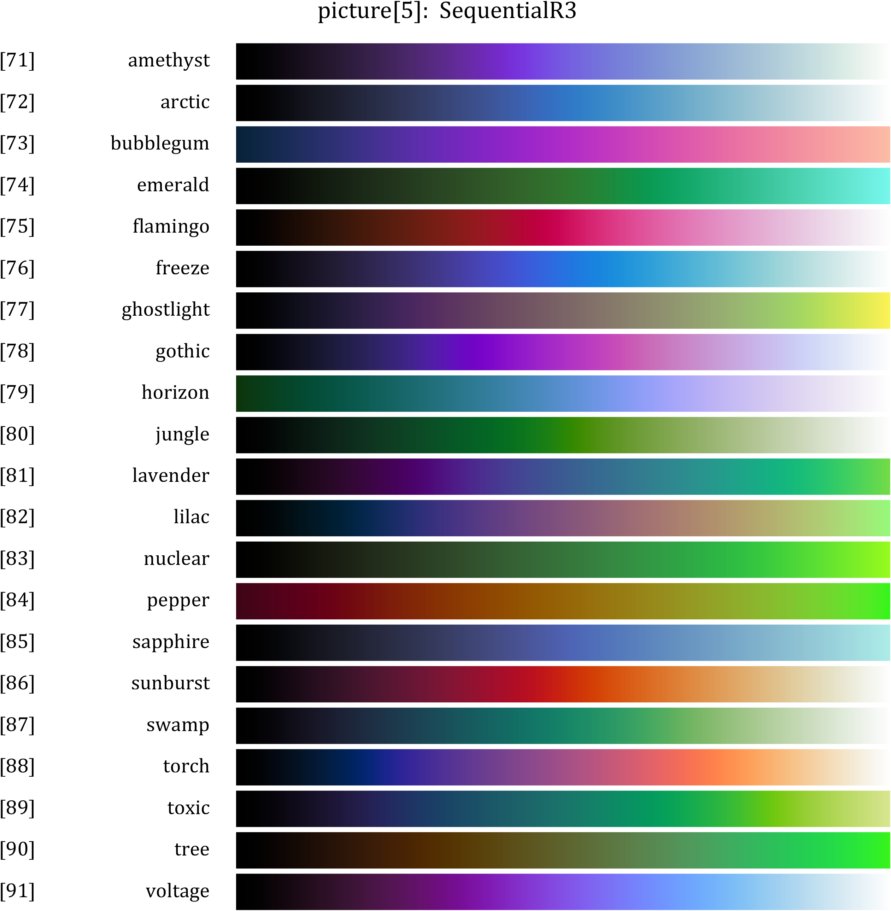
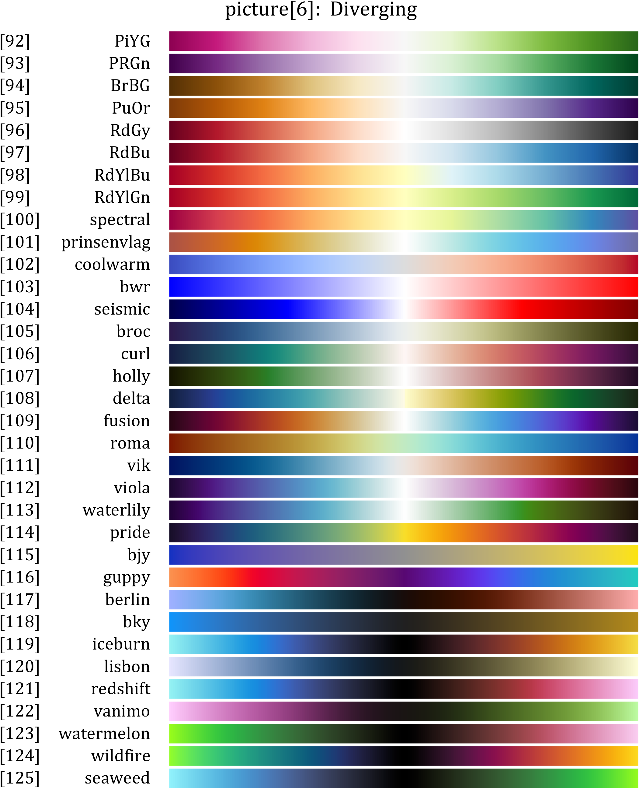
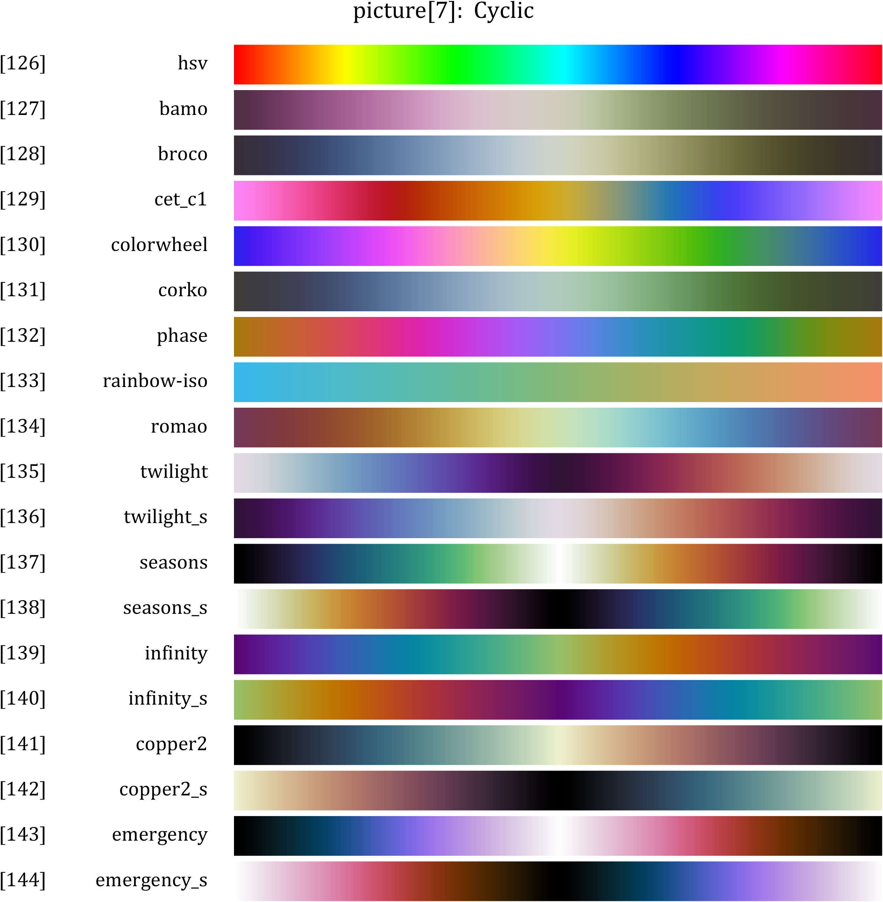
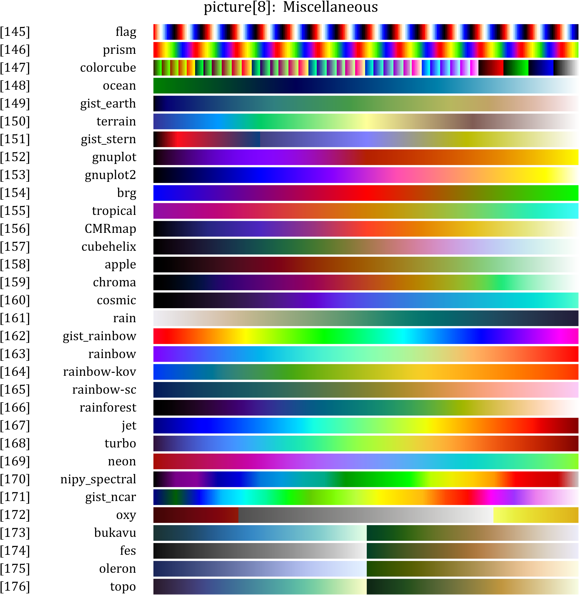
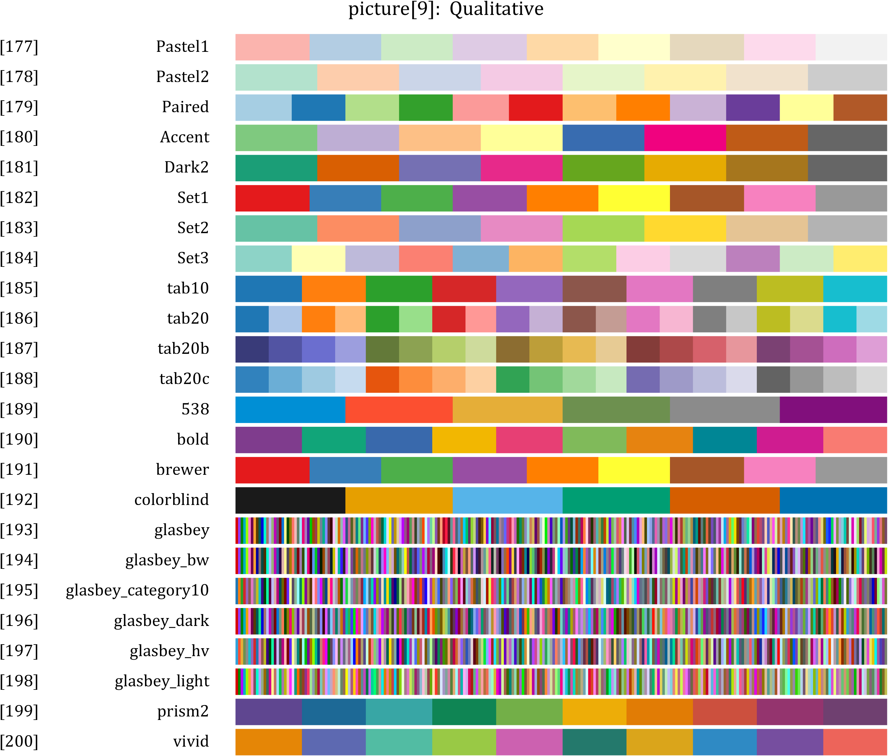

## See the demos in package.
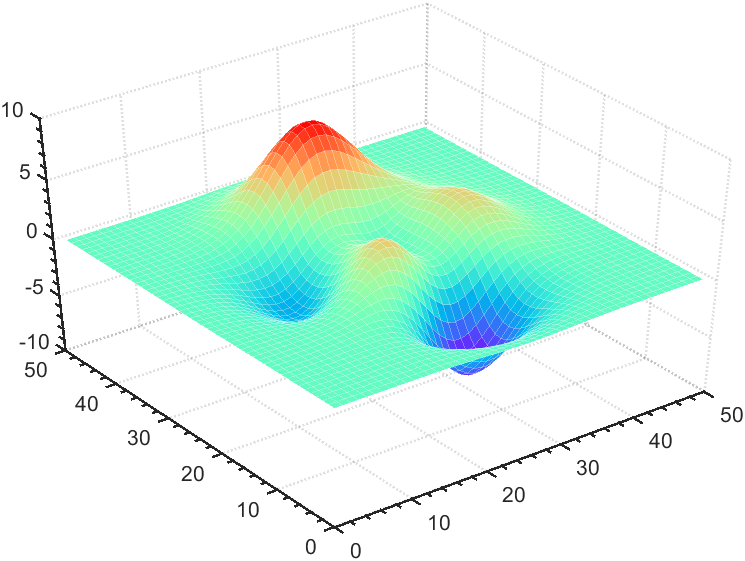
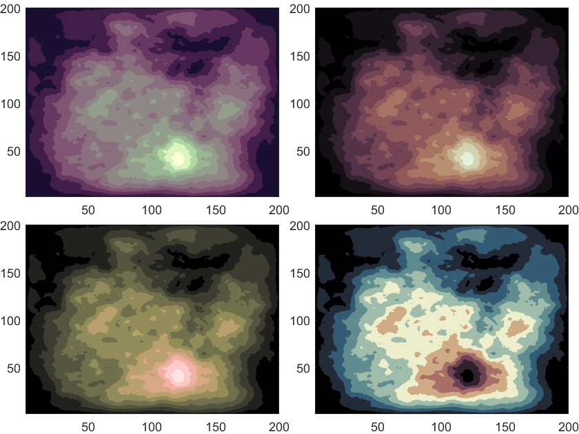
## Citations & Acknowledgements
+ Hunter, J. D. (2007). Matplotlib: A 2D graphics environment. Computing in Science & Engineering, 9(3), 90–95.
+ Bury, T. (2023). scicomap: Scientific colormaps for Python. https://github.com/ThomasBury/scicomap
+ van der Velden, E. (2020). CMasher: Scientific colormaps for Python. https://cmasher.readthedocs.io/
+ Crameri, F. (2018). Scientific colour maps. Zenodo. https://doi.org/10.5281/zenodo.1243862
+ Thyng, K. M., Greene, C. A., Hetland, R. D., Zimmerle, H. M., & DiMarco, S. F. (2016). True colors of oceanography. Oceanography, 29(3), 10-11. https://doi.org/10.5670/oceanog.2016.66
+ Kovesi, P. (2015). *Good Colour Maps: How to Design Them*. arXiv:1509.03700
+ Glasbey, C. A., van der Heijden, G. W. A. M., Toh, V. F. K., & Gray, A. (2007). Colour displays for categorical images. *Color Research & Application*, 32(4), 304–309. https://doi.org/10.1002/col.20327
+ Davis, M. (2023). palettable: Color Palettes for Python [Computer software]. Retrieved from https://jiffyclub.github.io/palettable/
